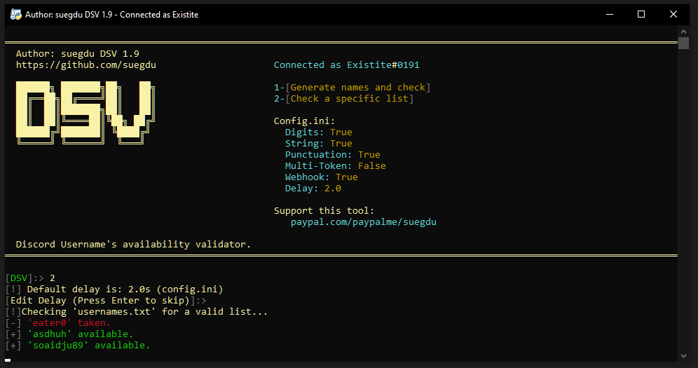

# DSV
Discord Username's availability checker.
#### For contribution and updates: <a href="https://discord.gg/Bww4DvKA4Z">Join the Discord</a>
---
- Checks for a specific list of usernames.
- Generates and checks for a specific given amount of usernames with a specific username length, (e.g 4 letters usernames.)
- Completely customizable.
 > Check <a href =#notes >notes</a> for a very important information before using this tool, and for some FAQ. And BEFORE opening an issue.

---
# How to use
- Have <a href="https://www.python.org/">Python</a> installed.
- First clone the repository or <a href="https://github.com/suegdu/DSV/archive/refs/heads/main.zip">download it as .zip</a>
- Install the required libraries, by running : ```pip install -r requirements.txt``` or `pip3 install -r requirements.txt` in your command line.
- Open `config.ini`
- Paste your account's token in front of the equal symbol `TOKEN`
- Configure DSV as how you'd like (`config.ini`)
- Run `dsv.py` 

- (For adding a specific list of usernames, create a file named `usernames.txt` in the same running directory as `dsv.py` and list your usernames there, separating them by a new line.)
- #### Note: It will only work with accounts that didn't proceed to apply the name change and has the pop up to update(Eg: Create an alt.). Read <a href =#notes >Notes</a> to know why.

# Images




# Notes
#### Disclaimer: I'm not responsible for/of any damage/results/returns/suspension made/resulted with/by this tool. It is your will to run, and once ran, it's your responsibility.


> ### Due to recent changes in Discord's API, Discord added CAPTCHA requirements. It will only work with an account that didn't proceed to apply the name change and has the pop up to update.


- Spamming Discord's API is against TOS, You may get your account suspended and I am not responsible. For a further caution, use an alt's token and a longer delay.
- You need to get your Discord's account's authorization token and paste it inside the variable: `TOKEN` . On how to do that check these following steps: https://www.androidauthority.com/get-discord-token-3149920/
<!-- (old)- Your account must receive the <a href="https://discord.com/blog/usernames">name change update</a> to use this tool or else you may face some bugs or an invalid continuation of an `Available` username.-->

<!-- (old)- If you kept getting an `Available` username message despite it being taken, that means you have either reached the limit (***API***) or your account didn't receive the update.-->
- Make sure to have a decent delay or you may get your account disabled. 
<!-- - > #### This is a very early and LIMITED build you may face some bugs, unknown bugs. It may not work for you and work for some. But with your informing help, we can make it better. <a href="https://github.com/suegdu/DSV/issues/new">Open an issue here</a>. -->
- I **demand** my credits to the code wherever it's used.

**Support**: <a href="https://www.paypal.com/paypalme/suegdu">Paypal</a>
