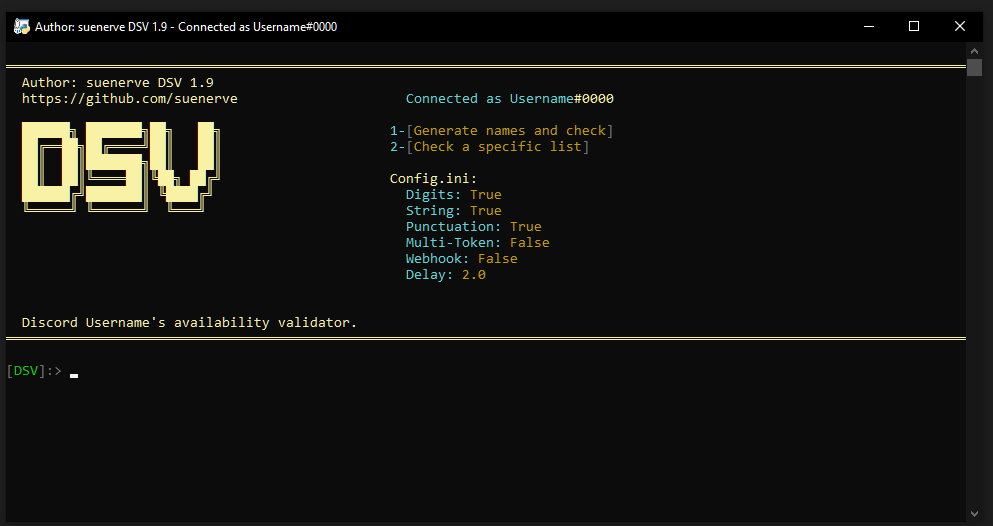

# DSV
Discord Username's availability checker.

(This is the only and only official repo. Do **NOT** download it from any other repo that claims to have it from me but edited. Check the date and commits of the repo before downloading it from any other repo.)


---
- Checks for a specific list of usernames.
- Generates and checks for a specific given amount of usernames with a specific username length, (e.g 4 letters usernames.)
- Supports Multi-Tokens.
- Supports Webhooks.
- Completely customizable.
  
 > Check <a href =#notes >notes</a> for a very important information before using this tool, and for some FAQ. And BEFORE opening an issue.

# How to use
- Have <a href="https://www.python.org/">Python</a> installed.
- First clone the repository or <a href="https://github.com/suenerve/DSV/archive/refs/heads/main.zip">download it as .zip</a>
- Install the required libraries, by running : ```pip install -r requirements.txt``` or `pip3 install -r requirements.txt` in your command line.
- Open `config.ini`
- Paste your account's token in front of the equal symbol `TOKEN`
- Configure DSV as how you'd like (`config.ini`)
- Run `dsv.py` 

> - For adding a specific list of usernames, create a file named `usernames.txt` in the same running directory as `dsv.py` and list your usernames there, separating them by a new line.
> - For adding multiple tokens, open `config.ini` and enable `MULTI-TOKEN` by making it `true` and paste your tokens inside `tokens.txt` separating them by a new line.


# Images



# Notes
#### Disclaimer: I'm not responsible for/of any damage/results/returns/suspension made/resulted with/by this tool. It is your will to run, and once ran, it's your responsibility.


> - This repository is licensed under a **NON-COMMERCIAL USE.** <a href="https://github.com/suenerve/Discord-Username-Checker/blob/main/LICENSE">READ here.</a>

- I **demand** my credits to the code wherever it's used.
- Spamming Discord's API is against TOS, You may get your account suspended/rate limited and I am not responsible.
- You need to get your Discord's account's authorization token and paste it inside the variable: `TOKEN` . On how to do that check these following steps: https://www.androidauthority.com/get-discord-token-3149920/
- Make sure to have a decent delay or you may get your account disabled. 


