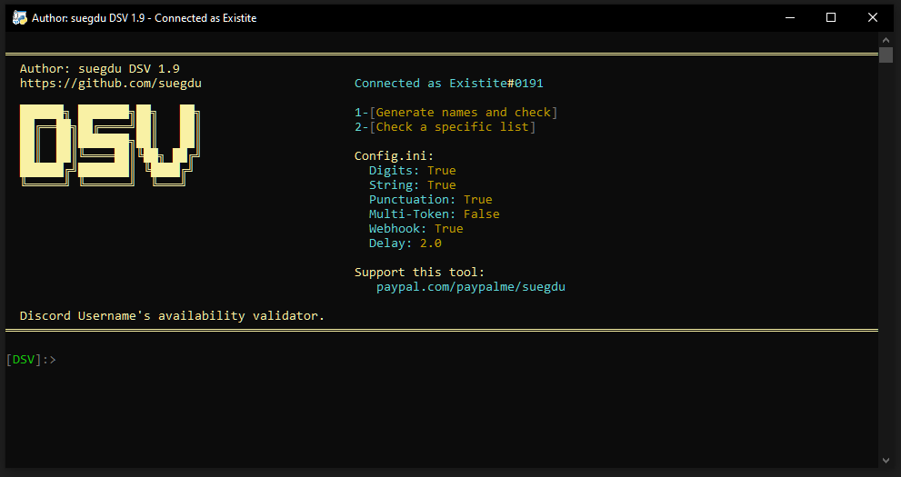
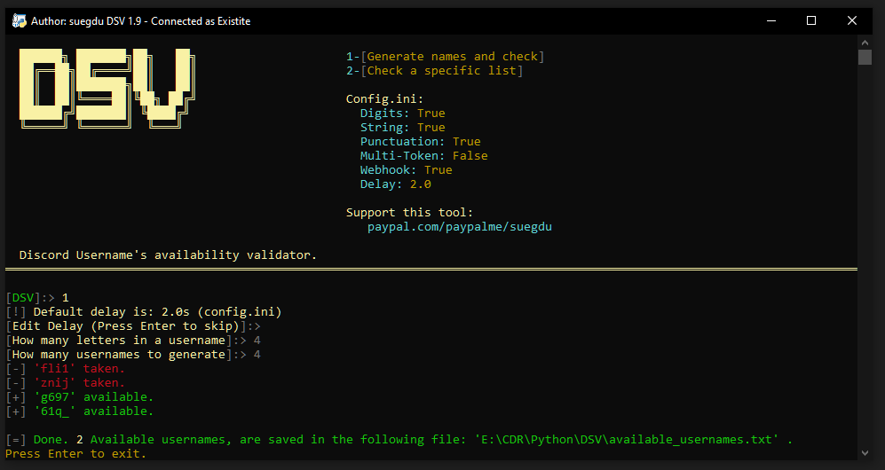

# DSV
Discord Username's availability checker. [![Support][support-badge]][support-link] [![PayPal][paypal-badge]][paypal-link]

(This is the only and only official repo. Do **NOT** download it from any other repo that claims to have it from me but edited. Check the date and commits of the repo before downloading it from any other repo.)

[paypal-badge]: https://img.shields.io/badge/PayPal-%23003087.svg?style=flat&logo=data:image/png;base64,iVBORw0KGgoAAAANSUhEUgAAABwAAAAgCAYAAAABtRhCAAAABHNCSVQICAgIfAhkiAAAAAlwSFlzAAAdhwAAHYcBj+XxZQAAABl0RVh0U29mdHdhcmUAd3d3Lmlua3NjYXBlLm9yZ5vuPBoAAAIZSURBVEiJvZa7a1RREIe/CRsIqBBQJEEUO5+YRgSx0JTBwkKwsBMU/4HY2dmKFmm1tRBREEGFYGMhvgolPlBsRBuJj5iIiRvzWWxuOF7v3r2Ld/ODhXNmhvnOzHnshZzU82rTamqqn9XX6jV1XB3K52wrtaHOV4S104J6Ue2vAtz2n7BUt9S+PCNv2FG5HZ11GDi1mkCA052AO2sG7s63tdcV9gON1BDZQA1gFlhTI3AmIgZTQ1rhlpphAFN5Qwqse/8A7uYNaX/r3j+Am9lAHQbmegmcjIhnyfwosLFXwEXgbM52BBhemdl6hOvSeEpSR9QldTYzDNUE+q2eyZer3lj2rwBHa4A9UA8UwE4kMS+yPexm/xZpPRDTwBvgCXA9Ip4XwEaBicT0MHNMlKz8ijrQxYKynMfVn7lcxzLnZAnwYJegEfV2QZ6P6kDW0rJX5lUHwAZgD7CP1l3b2yb0XETMow6WVDedS35Bfbf8+2LrqFfRVVt/DqDuLwm8nwM+qghIdcnk+6aP8hO60s7lFW4va2+iReAOcCgiTkZEM3M0OgBfJuNNwLqCmHvAY+AbMAO8BZ5GxNeihA2qH5iiuO/AWET8Ksnxl/o6ANMKizox1Q0sA65t45sDPiTzov0rvTJFagC7gM0FvoWIMJkXVdg1sLLUTwVHfqxXsPVt7tjWbnP98+3fRkXt/AG8Xy3gEnA5Ipa6Bf4BbzmPtw84RMAAAAAASUVORK5CYII=

[paypal-link]: https://paypal.me/suegdu
[support-link]: https://discord.com/invite/Bww4DvKA4Z
[support-badge]: https://img.shields.io/badge/Support-%2343b581.svg?style=flat&logo=data:image/png;base64,iVBORw0KGgoAAAANSUhEUgAAACAAAAAgCAYAAABzenr0AAAC4UlEQVRYR8WXS4jNcRTHP195bEgWkoVsCAspNcVoLGblsaAoFCalBqU8BhuPPDZeQ5LBRmHBYsok7KYor5TyKDI2UiQLZWwojs6d351+85977+93J7q/uqt7Hp/fOed3zvmLzGNm44BWYAUwB5gafm7hc/i9AXqAXkk/c0wrJWRmU4BDwHpgQko+/N8PXAcOS/pSS6cqgJmNBfYBe4HxmY6LYj+AE8BxSb8q2agIEG7dDSwaoeOi2kNgVaVoDAMws7nAHWDaP3JeNvMRWC7pVWx3CEC4+bMM533AE+B5MDYfWADMTEA7RFMciUGAkPPeRNi9svcDnZL+xM7MbBSwCzgG+IupdjwdreWaiAEOAEdqKLrzZknlW1cUNTOPxqMExEFJR91ACSCE/n2i2vdIOpVTF2bWAZysIeuvY4anogxwAdhaQ8FzPjsOu5lNAjYFnSuSvpX1QzreJmqiS9I2hQ73NdFkrknaGDlw5x8iHW880wsQV4ENNS7lOpMdYClwNxHanZLORgBebKcLOrsldUYyO4AzCbvLHOAi0J4QbJd0OTJ+D1iSANgOnEvYveQA94HFCcHvgDv1M7GC80op6AK2JOw+cIB3GQ2kmh1/Oe6oWISjgdfArARAnwM4fb3D5jew0lu2JCs6MbOc8Lvaj5EC9EhygGHHzFqA2yFVqbZRAhhJCtok+TMbPGY2BmgDzie6YKxWSkFOERZvsk7SjehVbA4zwJeXek6pCHOeYdHoWkk3IwCHWVOP5yBbeoY5jahoO6cv5PCUGpGPzlQrLhpL9YUc5wOt2CXNLDWMKhn0ifYSWFieqjleI5mBYRQAvHhS4zi2/wJokdRvZk3A0zohho7jAJFaSGKADkmDw8jMfMtpriMCQxeSAOBreGolK/volrQ66Pm3wqc6umnllSxKRc5S6q34FvA4zPx5mbevvpRGb7pxa3kE4UXZmA+TCKJxn2ZxPhv2cVosqv/1ef4XvUY7+DQzteEAAAAASUVORK5CYII=

**For contribution and updates: <a href="https://discord.gg/Bww4DvKA4Z">Join the Discord</a>**<br>

---
- Checks for a specific list of usernames.
- Generates and checks for a specific given amount of usernames with a specific username length, (e.g 4 letters usernames.)
- Supports Multi-Tokens.
- Supports Webhooks.
- Completely customizable.
- What about Proxies, Sniper, Catch unclaimed/banned, **No-Token Mode**? **<a href="https://discord.gg/Bww4DvKA4Z">Join the Discord</a>** to buy the paid version, really cheap.

 > Check <a href =#notes >notes</a> for a very important information before using this tool, and for some FAQ. And BEFORE opening an issue.

# How to use
- Have <a href="https://www.python.org/">Python</a> installed.
- First clone the repository or <a href="https://github.com/suegdu/DSV/archive/refs/heads/main.zip">download it as .zip</a>
- Install the required libraries, by running : ```pip install -r requirements.txt``` or `pip3 install -r requirements.txt` in your command line.
- Open `config.ini`
- Paste your account's token in front of the equal symbol `TOKEN`
- Configure DSV as how you'd like (`config.ini`)
- Run `dsv.py` 

> - For adding a specific list of usernames, create a file named `usernames.txt` in the same running directory as `dsv.py` and list your usernames there, separating them by a new line.
> - For adding multiple tokens, open `config.ini` and enable `MULTI-TOKEN` by making it `true` and paste your tokens inside `tokens.txt` separating them by a new line.

- #### Note: It will only work with accounts that didn't proceed to apply the name change and has the pop up to update(Eg: Create an alt.). Read <a href =#notes >Notes</a> to know why.

# Images




# Notes
#### Disclaimer: I'm not responsible for/of any damage/results/returns/suspension made/resulted with/by this tool. It is your will to run, and once ran, it's your responsibility.


> - This repository is licensed under a **NON-COMMERCIAL USE.** <a href="https://github.com/suegdu/Discord-Username-Checker/blob/main/LICENSE">READ here.</a>

- I **demand** my credits to the code wherever it's used.
- Spamming Discord's API is against TOS, You may get your account suspended/rate limited and I am not responsible. For a further caution, use an alt's token and a longer delay.
- You need to get your Discord's account's authorization token and paste it inside the variable: `TOKEN` . On how to do that check these following steps: https://www.androidauthority.com/get-discord-token-3149920/
- Make sure to have a decent delay or you may get your account disabled. 


